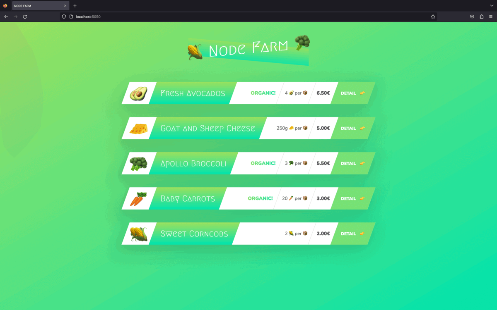

# 🥑 NODE farm

## Table of contents

- [Overview](#overview)
  - [How to run this code](#how-to-run-this-code)
  - [The challenge](#the-challenge)
  - [Screenshot](#screenshot)
  - [Links](#links)
- [My process](#my-process)
  - [Built with](#built-with)
  - [What I learned](#what-i-learned)
- [Author](#author)

## Overview

### How to run this code
- Clone the repository
- Run npm i
- npm start or PORT=somePort node index.js (if PORT 5050 is taken)

### The challenge

I created a server with different routes. The layout and the content of the page is based on pathName and queryParams

### Screenshot

### Links

- [Solution URL](https://github.com/superpooperxxx/node-farm)

## My process

### Built with

- Node.js
- fs, http, url modules

### What I learned

- How to create my own server
- How to render different content based on url
- How to work with file system & parse url

## Author

- Github - [superpooperxx](https://github.com/superpooperxxx)
- LinkedIn - [Kyrylo Haiduk](https://www.linkedin.com/in/kyrylo-haiduk/)
- Telegram - [@haidukwork](https://t.me/haidukwork)
- Frontend Mentor - [@superpooperxxx](https://www.frontendmentor.io/profile/superpooperxxx)
